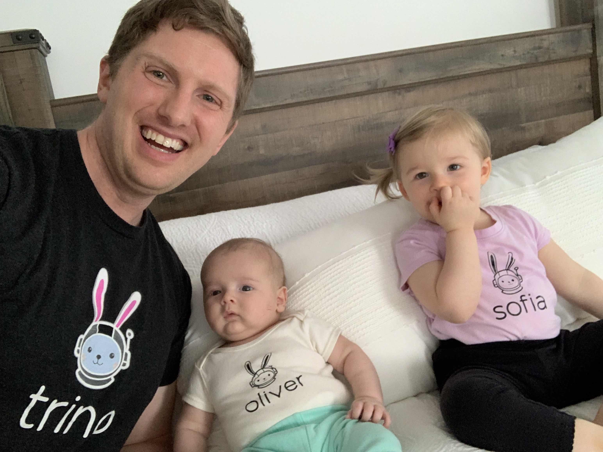
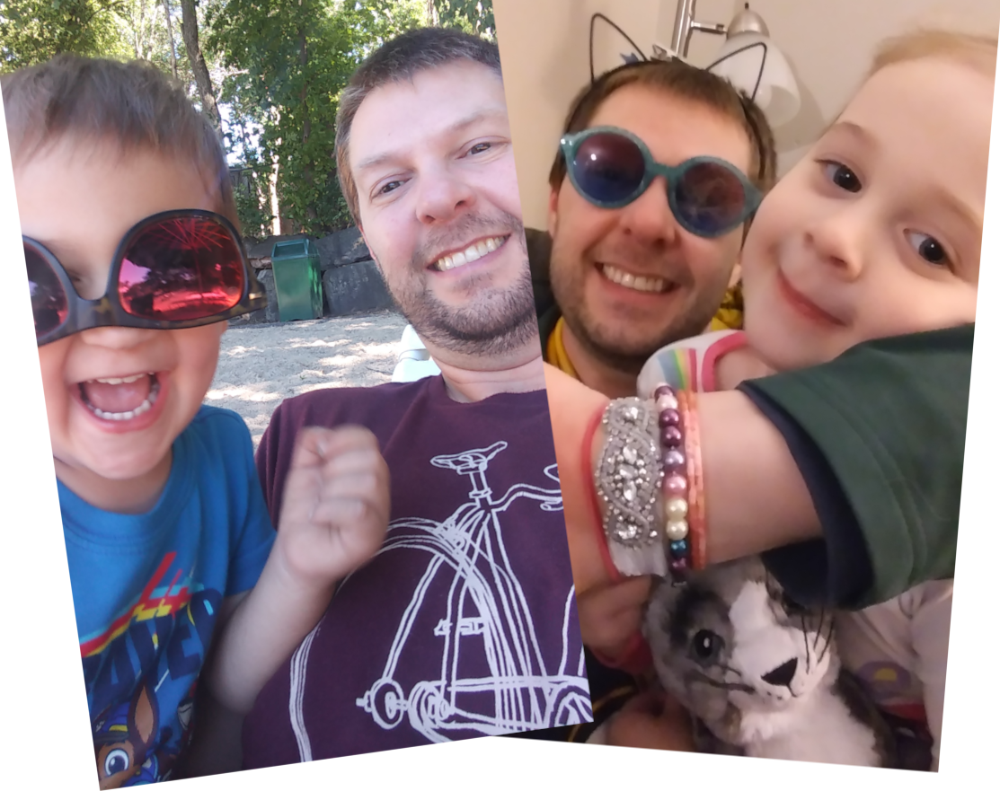

## Brian Olsen

### Head of Developer Relations @ Tabular


<div style="float: left; width: 60%; text-align: left; font-size:36px;" >
  <ul>
    <li>Chief Papa Officer reporting into the CMO/CEO</li>
    <li>open source/data nerd</li>
    <li>ex-Starburst, ex-USMC</li>
    <li>makes noise with copper strings and wood</li>
    <li>disclaimer: I talk a lot</li>
    <li>making data virtualization cool again</li>
    <li>first OSN I'm not watching online!</li>
  </ul>
</div>

 <!-- .element width="100%" -->

<!-- .element style="float: left;  width: 40%;" -->

```SQL
SELECT dad_jokes
FROM the.dadabase;
```

<!-- .element class="r-fit-text" -->

-vertical

## Cody Zwiefelhofer

### Senior Software Engineer @ Starburst


<div style="float: left; width: 60%; text-align: left; font-size:36px;" >
  <ul>
    <li>father of two</li>
    <li>Senior SDE @ Starburst Data; ex-Amazon, Best Buy and Optum</li>
    <li>based in the Twin Cities since 2006</li>
    <li>first OSN as a speaker, third OSN total</li>
    <li>hobbies: camping, tennis, reading, but mostly dad stuff</li>
  </ul>
</div>

 <!-- .element width="100%" -->

<!-- .element style="float: left;  width: 40%;" -->

Why did the data engineer leave their partner?

They found out it was a one-to-many relationship.
<!-- .element class="fragment" -->

<!-- .element class="r-fit-text" -->
